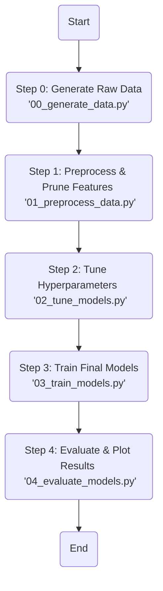

# Feature-Enhanced Graph Neural Networks for Classification of Synthetic Graph Generative Models: A Benchmarking Study
This repository contains the official implementation for the paper "Feature-Enhanced Graph Neural Networks for Classification of Synthetic Graph Generative Models: A Benchmarking Study". We introduce a large-scale synthetic dataset for graph classification and benchmark the performance of several Graph Neural Network (GNN) architectures.

The project is structured as a series of sequential scripts to ensure full reproducibility of our results, from data generation to final model evaluation.

## Project Pipeline
The project is structured as a series of sequential scripts to ensure full reproducibility of our results, from data generation to final model evaluation.


## Repository Structure
The repository is organised to separate source code, executable script, data, and results.
```bash
Synthetic-Graph-Classification-GNN/
├── data/              # For storing graph data (see data/README.md)
├── results/           # Output directory for plots, metrics, and models
├── src/               # Core source code (models, utils, etc.)
├── scripts/           # Executable scripts for running the pipeline
├── .gitignore
├── README.md          # This file
└── requirements.txt   # Python dependencies
```
## Running this Project
Follow these steps to set up the environment and run the project.
1. Clone the repository
```bash
git clone https://github.com/j-dyer-code/Synthetic-Graph-Classification-GNN.git
cd Synthetic-Graph-Classification-GNN
```
2. Create a Virtual Environment (recommended)
```bash
python -m venv venv
source venv/Scripts/activate
```
3. Install Dependencies
```bash
pip install -r requirements.txt
```
4. Download the Dataset
Follow the instructions in the data/README.md file to download the pre-generated dataset. This is the recommended approach to ensure you are using the exact data from our experiments.

5. Run the Pipeline
To run the entire pipeline from start to finish, execute the scripts from the scripts/ directory in numerical order:
- Generate data. Only do this if you have not followed the instructions in step 4 and wish to reproduce the dataset from scratch
```bash
python scripts/00_generate_data.py
```
- Preprocess Data & Prune Features. This script loads the raw data, peforms feature pruning, and saves the final dataset as data/pyg_data.pkl
```bash
python scripts/01_preprocess_data.py
```
- Tune Hyperparameters. This runs the Optuna hyperparameter search and saves the best parameters to results/metrics/best_trials_summary.csv
```bash
python scripts/02_tune_models.py
```
- Train Final Models. This scripts trains the final tuned models using the hyperparameters found in the previous step. Best models are saved to results/final_models/
```bash
python scripts/03_train_models.py
```
- Evaluate Models & generate plots. This performs a comprehensive evaluaiton of all trained models and the SVM baseline, generating the final plots and metric tables to results/evaluation_plots/ and results/metrics/ respectively
```bash
python scripts/04_evaluate_models.py
```

## Reproducibility
We have set a global random seed for random, numpy, optuna, and torch, to ensure consistent data generation and model initialisation.
